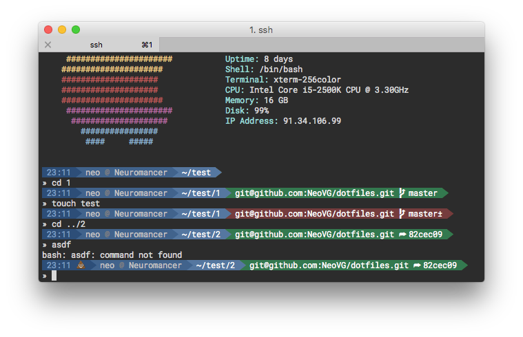

# dotfiles

Personal unix dotfiles

- Bash prompt inspired by [Agnoster](https://gist.github.com/agnoster/3712874) theme for [Oh My Zsh](https://github.com/robbyrussell/oh-my-zsh).

- $PATH set for Homebrew if present
- $EDITOR set to vim if present
- Useful aliases:
```shell
alias ..='cd ..'
alias la='ls -lah'
alias du1='du -xHhd 1'
alias df='df -h'
alias tmux='tmux -2 -CC'
alias su='sudo su'                               # if not root
alias ls='ls -G'                                 # FreeBSD and macOS
alias ls='ls --color'                            # Linux
alias ports='sudo lsof -i -P | grep -i "listen"' # macOS
```
- Shell completion for
    - sudo
    - git
    - homebrew
- Sysinfo on login (bsdinfo, archey or screenfetch, whichever is found first)
- Nifty .vimrc

## Usage

Read only:

```shell
git clone https://github.com/NeoVG/dotfiles.git
source ~/dotfiles/bashrc
```

Read/Write:

```shell
git clone git@github.com:NeoVG/dotfiles.git
source ~/dotfiles/bashrc
```

## License

This stuff is released under the [GPLv3](LICENSE.md).
